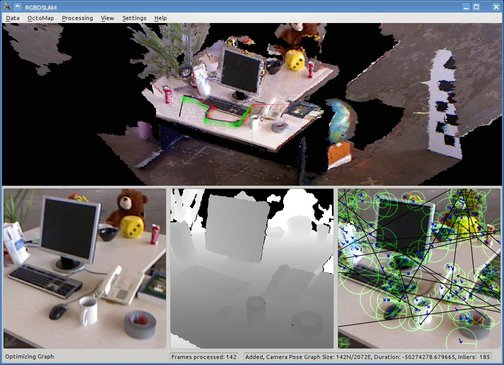

# rgbdslam_v2_cg

Modified version of **[RGBDSLAMv2](http://felixendres.github.io/rgbdslam_v2/)** which from http://github.com/felixendres/rgbdslam_v2/archive/kinetic.zip

* RGBD-SLAM Implements a SLAM-Frontend based on structure from motion using visual features to identify keypoints in the RGBD image of a kinect. It makes use of the g2o SLAM backend to compute a globally consistent trajectory from the individual transformations provided by the frontend.

* a state-of-the-art SLAM system for RGB-D cameras, e.g., the Microsoft Kinect or the Asus Xtion Pro Live.  You can use it to create 3D point clouds or OctoMaps.

* based on the open source projects, ROS, OpenCV, OpenGL, PCL, OctoMap, SiftGPU, g2o, and more.

-----

<div align=center>

</div>

# Prerequisites

* Ubuntu 16.04 + ROS Kinetic
* G2O
  - recommend version: commit id **ff647bd** (ff647bd7537860a2b53b3b774ea821a3170feb13)

# Build

The compilation may take a lot of memory, particularly if the environment variable
**ROS_PARALLEL_JOBS** is set.

```sh
mkdir ws_rgbdslam/src -p
cd ws_rgbdslam/src
git clone https://github.com/cggos/rgbdslam_v2_cg.git
cd rgbdslam_v2_cg & bash install_deps.sh # gicp and SiftGPU
cd ../../
rosdep update
rosdep install rgbdslam
source devel/setup.bash
nice catkin_make -DCMAKE_BUILD_TYPE=Release -j3
```

# Run

```sh
rosbag play rgbd_dataset_freiburg1_xyz.bag # with dataset
# or
roslaunch openni_camera openni_node.launch # with live camera

roslaunch rgbdslam rgbdslam.launch
```

# Docs

API Doc with **rosdoc_lite** in ROS:

```sh
rosdoc_lite <path-to-ws_rgbdslam/src/rgbdslam_v2_cg>
```

The main classes are the following:  

* **Node** - Holds the data for a graph node, e.g., the extracted features and their position in the image plane and the local 3D coordinate systems.
It provides functionality to find the transformation to another node and for publishing the associated pointcloud.
* **GraphManager** - Decides for each Node, which edges are included in the graph. Stores all Nodes with valid edges and optimizes the camera pose graph globally (or locally) with g2o as SLAM backend.
Provides functionality to send (ROS-Msgs) or save (to PCD File) the globally consistent whole model.

The following classes are mainly for communication with ROS and the user:  

* **OpenNIListener** - Subscribes to the openni topics, constructs a node for each image-pointcloud pair and hands it to the graph manager. Online visualization results are sent out.
* **Graphical_UI** - Constructs a QT GUI for easy control of the program
* **RosUi** - a UI for controlling the program via ROS service calls
* **QtROS** - Sets up a thread for ROS event processing, to seperate SLAM-computations from the GUI
* **GLViewer** - OpenGL based display of the 3d model

# Papers

```bibtex
@article{endres14tro,
  title =   {3{D} Mapping with an {RGB-D} Camera},
  author =  {F. Endres and J. Hess and J. Sturm and D. Cremers and W. Burgard},
  journal = {IEEE Transactions on Robotics},
  month = {Feb},
  year =    {2014},
  volume = {30},
  number = {1},
  pages = {177--187},
}
```
